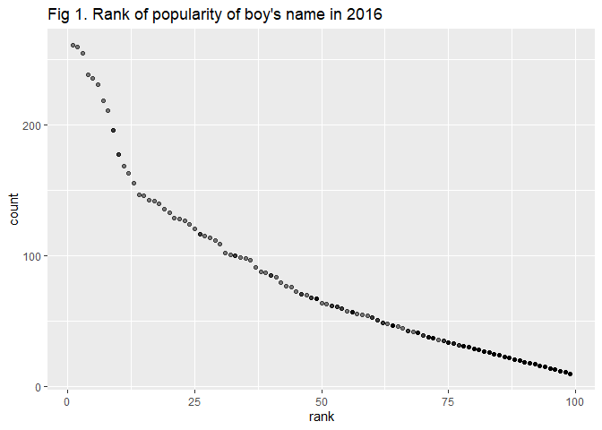

p8105\_hw2\_yl4360
================

# Problem 1

**Read and clean the Mr. Trash Wheel sheet.**

``` r
library(tidyverse)
library(dplyr)
library(readxl)
data_MTW = read_excel("./HealthyHarborWaterWheelTotals2018-7-28.xlsx", sheet = "Mr. Trash Wheel", range = "A2:N338") %>% 
  janitor::clean_names() %>% 
  drop_na(dumpster) %>% 
  mutate(
    sports_balls = round(sports_balls),
    sports_balls = as.integer(sports_balls))
```

    ## Warning in FUN(X[[i]], ...): strings not representable in native encoding
    ## will be translated to UTF-8

**Read and clean precipitation data for 2017 and
2018.**

``` r
data_2017 = read_excel("./HealthyHarborWaterWheelTotals2018-7-28.xlsx", sheet = "2017 Precipitation", range = "A2:B15") %>% 
  janitor::clean_names() %>% 
  drop_na(total)
year_2017 = tibble(year = rep(2017, 13))
data_2017 = bind_cols(year_2017, data_2017)

data_2018 = read_excel("./HealthyHarborWaterWheelTotals2018-7-28.xlsx", sheet = "2018 Precipitation", range = "A2:B15") %>% 
  janitor::clean_names() %>% 
  drop_na(total)
year_2018 = tibble(year = rep(2018, 8))
data_2018 = bind_cols(year_2018, data_2018)

data_pre = bind_rows(data_2017, data_2018) %>% 
  mutate(month = month.name[month])
```

**Interpretation**

The `data_MTW` dataset contains 285 observations of 14 variables related
to dumpster-specific data. The key variables are dumpster, month, year,
date, weight\_tons, volume\_cubic\_yards, plastic\_bottles, polystyrene,
cigarette\_butts, glass\_bottles, grocery\_bags, chip\_bags,
sports\_balls, homes\_powered.

The `data_pre` dataset contains 21 observations of 3 variables related
to each month’s total precipitation data for 2017 and 2018. The key
variables are year, month, total. The total precipitation in 2018 is
23.5 and the total precipitation in 2017 is 32.93.

# Problem 2

**Clean the data in pols-month.csv.**

``` r
data_pols = read_csv("./fivethirtyeight_datasets/pols-month.csv") %>% 
  separate(col = mon, into = c("year", "month", "day")) %>% 
  mutate(
    month = as.integer(month), 
    month = month.name[month],
    year = as.integer(year),
    day = as.integer(day),
    president = ifelse(prez_gop == 0, "dem", "gop")) %>% 
  select(-prez_gop, -prez_dem, -day)
```

    ## Parsed with column specification:
    ## cols(
    ##   mon = col_date(format = ""),
    ##   prez_gop = col_double(),
    ##   gov_gop = col_double(),
    ##   sen_gop = col_double(),
    ##   rep_gop = col_double(),
    ##   prez_dem = col_double(),
    ##   gov_dem = col_double(),
    ##   sen_dem = col_double(),
    ##   rep_dem = col_double()
    ## )

**Clean the data in snp.csv.**

``` r
data_snp = read_csv("./fivethirtyeight_datasets/snp.csv") %>% 
  separate(col = date, into = c("day", "month", "year")) %>% 
  mutate(
    month = as.integer(month),
    year = as.integer(year),
    day = as.integer(day)) %>% 
  arrange(year, month) %>% 
  mutate(month = month.name[month]) %>% 
  select(year, month, everything())
```

    ## Parsed with column specification:
    ## cols(
    ##   date = col_character(),
    ##   close = col_double()
    ## )

**Tidy the unemployment data.**

``` r
data_uem = read_csv("./fivethirtyeight_datasets/unemployment.csv") %>% 
  pivot_longer(Jan:Dec, 
            names_to = "month",
             values_to = "% of unemployment") %>% 
  rename(year = Year) %>% 
   mutate(month = match(month, month.abb),
         month = month.name[month])
```

    ## Parsed with column specification:
    ## cols(
    ##   Year = col_double(),
    ##   Jan = col_double(),
    ##   Feb = col_double(),
    ##   Mar = col_double(),
    ##   Apr = col_double(),
    ##   May = col_double(),
    ##   Jun = col_double(),
    ##   Jul = col_double(),
    ##   Aug = col_double(),
    ##   Sep = col_double(),
    ##   Oct = col_double(),
    ##   Nov = col_double(),
    ##   Dec = col_double()
    ## )

``` r
pols_snp = left_join(data_pols, data_snp, by = c("year","month")) 
pols_snp_uem = left_join(pols_snp, data_uem, by = c("year","month"))
```

**Interpretation**

The dataset `data_pols` contains 822 observations of 9 variables related
to the number of national politicians who are democratic or republican
at any given time. The key variables are year, month, gov\_gop,
sen\_gop, rep\_gop, gov\_dem, sen\_dem, rep\_dem, president. The range
of year is from 1947 to 2015.

The dataset `data_snp` contains 787 observations of 4 variables realted
to Standard & Poor’s stock market index (S\&P). The key variables are
year, month, day, close. The range of year is from 1950 to 2015.

The dataset `data_uem` contains 816 observations of 3 variables realted
to the perventage of unemployment at any given time. The key variables
are year, month, % of unemployment. The range of year is from 1948 to
2015.

# Problem 3

**Load and tidy Popular\_Baby\_Names.csv.**

``` r
baby_names = read_csv("./Popular_Baby_Names.csv") %>% 
  janitor::clean_names() %>% 
  mutate(gender = str_to_lower(gender),
         ethnicity = str_to_lower(ethnicity),
         childs_first_name = str_to_lower(childs_first_name),
         ethnicity = recode(ethnicity, `asian and paci` = "asian and pacific islander", `black non hisp` = "black non hispanic", `white non hisp` = "white non hispanic")) %>% 
  distinct() 
```

    ## Parsed with column specification:
    ## cols(
    ##   `Year of Birth` = col_double(),
    ##   Gender = col_character(),
    ##   Ethnicity = col_character(),
    ##   `Child's First Name` = col_character(),
    ##   Count = col_double(),
    ##   Rank = col_double()
    ## )

**Produce a table showing the rank in popularity of the name “Olivia” as
a female baby name over time.**

``` r
olivia  = baby_names %>% 
  filter(gender == "female", childs_first_name == "olivia") %>% 
  select(year_of_birth, ethnicity, rank) %>% 
  pivot_wider(
    names_from = "year_of_birth",
    values_from = "rank") %>% 
  knitr::kable(caption = "Table 1.Tthe rank in popularity of the name “Olivia” as a female baby name over time",align = "c")
olivia
```

|         ethnicity          | 2016 | 2015 | 2014 | 2013 | 2012 | 2011 |
| :------------------------: | :--: | :--: | :--: | :--: | :--: | :--: |
| asian and pacific islander |  1   |  1   |  1   |  3   |  3   |  4   |
|     black non hispanic     |  8   |  4   |  8   |  6   |  8   |  10  |
|          hispanic          |  13  |  16  |  16  |  22  |  22  |  18  |
|     white non hispanic     |  1   |  1   |  1   |  1   |  4   |  2   |

Table 1.Tthe rank in popularity of the name “Olivia” as a female baby
name over time

**Produce a table showing the most popular name among male children over
time.**

``` r
pop_na_male = baby_names %>% 
  filter(gender == "male", rank == 1) %>% 
  select(-gender, -rank, -count) %>% 
   pivot_wider(
    names_from = "year_of_birth",
    values_from = "childs_first_name") %>% 
  knitr::kable(caption = "Table 2. The most popular name among male children over time",align = "c")
pop_na_male
```

|         ethnicity          |  2016  |  2015  |  2014  |  2013  |  2012  |  2011   |
| :------------------------: | :----: | :----: | :----: | :----: | :----: | :-----: |
| asian and pacific islander | ethan  | jayden | jayden | jayden |  ryan  |  ethan  |
|     black non hispanic     |  noah  |  noah  | ethan  | ethan  | jayden | jayden  |
|          hispanic          |  liam  |  liam  |  liam  | jayden | jayden | jayden  |
|     white non hispanic     | joseph | david  | joseph | david  | joseph | michael |

Table 2. The most popular name among male children over time

**Scatterplot**

``` r
plot = baby_names %>% 
  filter(
    gender == "male",
    ethnicity == "white non hispanic",
    year_of_birth == 2016) %>% 
  ggplot(aes(x = rank, y = count))+
  geom_point(alpha = 0.5) + 
  labs(title = "Fig 1. Rank of popularity of boy's name in 2016") 

plot
```

<!-- -->
